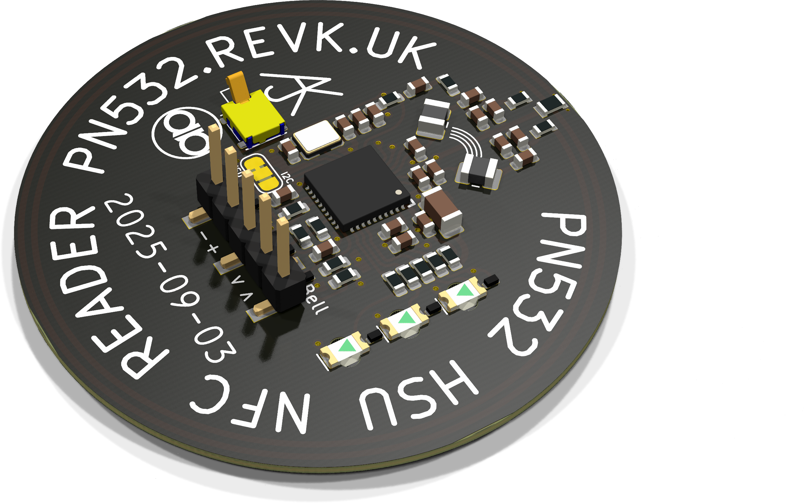

# ESP32-PN532

PN532 (HSU) library

- Platform: ESP-IDF (e.g. ESP32) and linux/MacOS
- Can work with DESFireAES library for NXP MIFARE DESFire EV1 cards
- See include file for details of functions

This allows *initiator* functiosn to act as a host, detect a card present, get UID and ATS, and do data exchange messages (typically used with DESFire).

It is being extended to allow *target* functions.

## PCB design

Includes KiCad PCB design for PN532 based NFC reader board and 3D case designs. Unlike some NFC boards this includes three traffic light LEDs, a tamper switch, and external contacts for a door bell push, all accessable as GPIO over the HSU connection.

3D case designs are included for surface mount and mouting on UK power socket back box.

---

Copyright © 2019-23 Adrian Kennard, Andrews & Arnold Ltd. See LICENCE file for details. GPL 3.0
